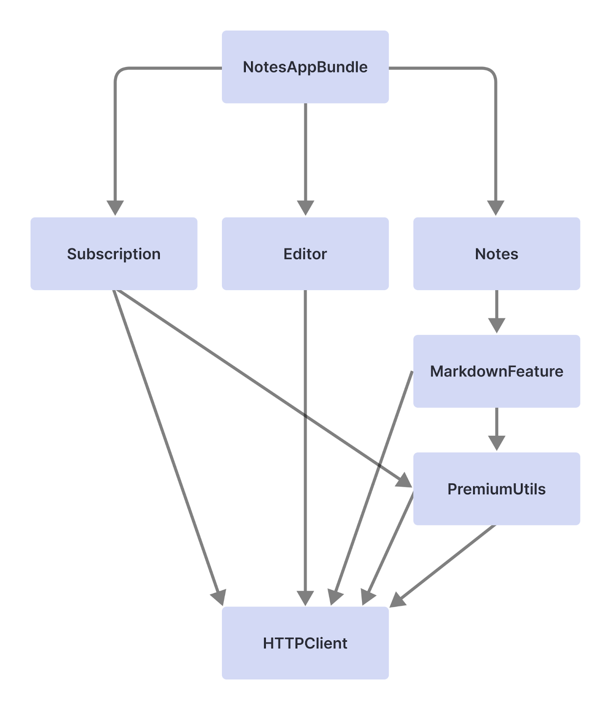

Practice project for integrating the [modularization article from Bruno Rocha](https://www.runway.team/blog/how-to-improve-ios-build-times-with-modularization)

The first commit contains the implementation of the dependency graph showcased at the beginning of the article:

As described by the article, this scales badly as on each change of the HTTPClient, a recompile is needed for all the modules that imports it.
Instead:
- We made those modules dependent on a protocol
- We create a separate module for the implementation
- The main module imports everything, assembles the modules and injects the concrete implementation.

The protocol isn't likeley to change much during our dev (susceptible to change mostly at the beginning of its declaration but rarely later)
If the HTTPClient implementation module changes, any module that depends on the HTTPClient will be recompiled, thus, keeping compiling times fast.
